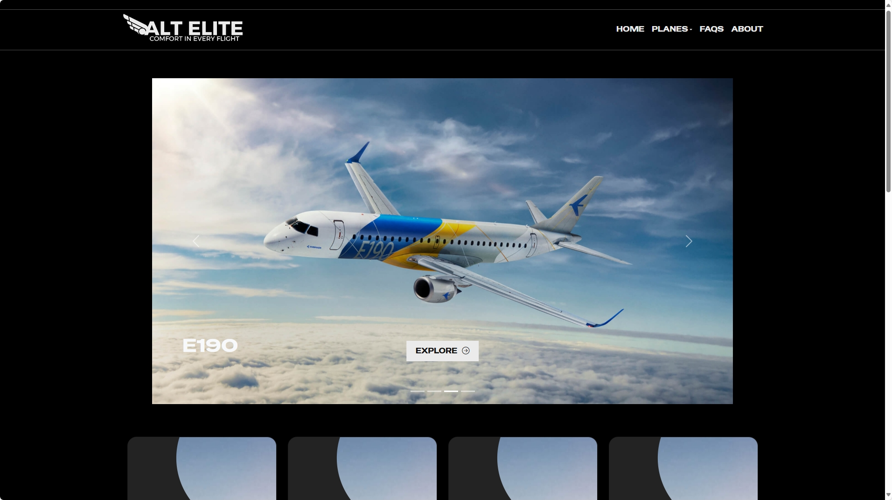
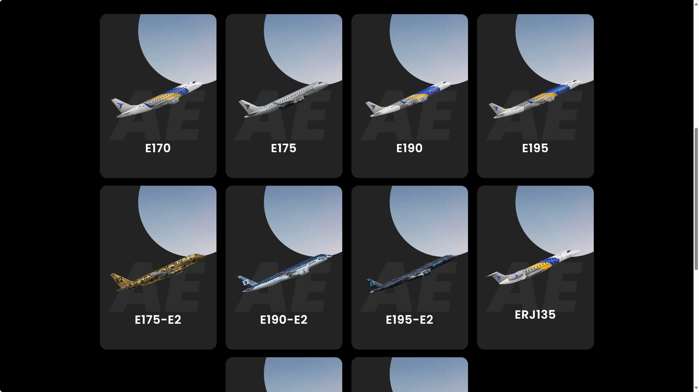
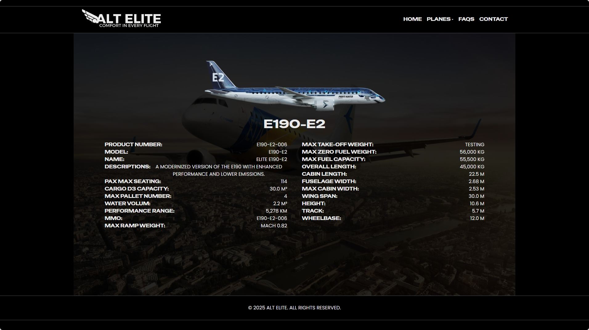
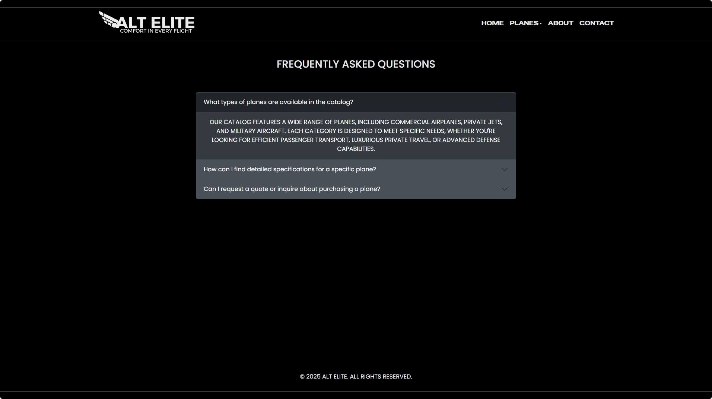

# ✈️ Airplane-Catalog

A responsive and visually engaging web application that showcases a curated catalog of airplanes. Built using **HTML**, **CSS**, **JavaScript**, and **Bootstrap**, this project demonstrates clean UI design, interactive components, and mobile-friendly responsiveness.

---

## 📋 Features
- Responsive layout using Bootstrap
- Interactive UI components
- Clean and modern design
- Image-based catalog entries

---

## 🛠️ Technologies Used
- HTML5
- CSS3
- JavaScript (ES6)
- Bootstrap 5

---

## 📸 Screenshots
Below are sample screenshots of the website located in the `images/` directory:








---

## 🚀 How to Run
1. Clone the repository:
   ```bash
   git clone https://github.com/yourusername/Airplane-Catalog.git
   ```
2. Navigate to the project directory:
   ```bash
   cd Airplane-Catalog
   ```
3. Open `index.html` in your browser to view the catalog.

---

## 📄 License
This project is licensed under the MIT License. See the [LICENSE](LICENSE) file for details.
